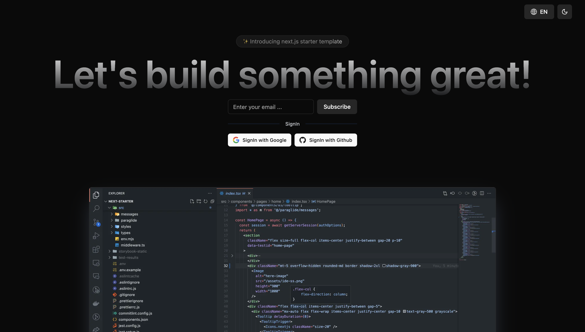

# <div align="center">✨ Welcome to next.js super template</div>



## Support


## Setup

### Prerequisites

Before you begin, ensure you have met the following requirements:

- You have installed [Node.js](https://nodejs.org/) (v22).
- You have installed [pnpm](https://pnpm.io/).
- You have a [Git](https://git-scm.com/) client installed.
- You have a prisma database url set up and running.

### Steps

1. **Clone the repository:**

   ```sh
   git clone https://github.com/pulkit-30/next-starter.git
   cd next-starter
   ```

2. **Install dependencies:**

   ```sh
   pnpm install
   ```

3. **Set up environment variables:**

   - Create a `.env` file in the root directory.
   - Add the necessary environment variables as specified in `.env.example`.

4. **Run the development server:**

   ```sh
   pnpm run dev
   ```

5. **Open your browser:**
   - Navigate to `http://localhost:3000` to see the application running.

## Author

[@pulkit gupta](https://pulkits.me)
